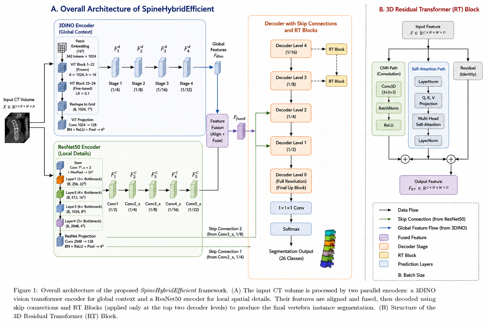

# SpineHybridEfficient

**Frozen Self-Supervised Vision Transformers with Dual Encoders for Single-Stage 3D Vertebrae Instance Segmentation**

> MSc Data Science with Advanced Research — University of Hertfordshire (MSDS24021), 2026  
> Submitted to: *Biomedical Signal Processing and Control* (Elsevier)

---

## Architecture



**(A) Overall Architecture:** The input CT volume is processed by two parallel encoders — a frozen 3DINO ViT-Large encoder for global anatomical context and a trainable ResNet50 encoder for local spatial details. Their features are aligned and fused at a 4³ bottleneck, then decoded using skip connections and RT Blocks (applied at the top two decoder levels) to produce the final 26-class vertebra instance segmentation.

**(B) 3D Residual Transformer (RT) Block:** Combines a CNN path (Conv3D → BatchNorm → ReLU) with a Self-Attention path (LayerNorm → Q,K,V projection → Multi-Head Self-Attention → LayerNorm) residually, enabling both local and global feature reasoning at low spatial resolutions.

---

## Results on VerSe 2019+2020

| Method | Val DSC | Trainable Params | Stage |
|---|---|---|---|
| UNETR | 0.3926 | 86M | Single |
| ViT-Adapter-UNETR | 0.4160 | 43M | Single |
| nnU-Net | 0.71 | ~32M | Single |
| **SpineHybridEfficient (ours)** | **0.7845** | **~33M** | **Single** |

> **~33M trainable parameters breakdown:**
> - 3DINO last 2 transformer blocks (unfrozen): ~24M  
> - ResNet50 encoder: ~7M  
> - Decoder + segmentation head: ~2M

---

## Dataset

VerSe 2019 + VerSe 2020: https://github.com/anjany/verse  
284 CT scans | 26 classes (background + C1–S1)

---

## Repository Structure

```
SpineHybridEfficient/
├── architecture.png             ← model architecture diagram
├── src/
│   ├── models/
│   │   └── model.py             ← SpineHybridEfficient architecture
│   ├── train/
│   │   └── train.py             ← training script
│   ├── inference/
│   │   └── infer.py             ← 256³ sliding window inference
│   ├── preprocess/
│   │   └── preprocess.py        ← VerSe19+20 preprocessing
│   └── utils/
│       ├── dataset.py           ← SpineNpyDataset + augmentation
│       ├── losses.py            ← combined loss functions
│       └── metrics.py           ← Dice + identification rate
├── configs/
│   └── config.yaml
├── results/
│   └── logs/
├── paper/
│   ├── main.tex
│   └── references.bib
└── requirements.txt
```

---

## Setup

```bash
git clone https://github.com/JavariaZafar23/SpineHybridEfficient
cd SpineHybridEfficient
pip install -r requirements.txt
```

### 3DINO Encoder

Required but not included. Download from: https://github.com/YtongXie/3DINO  
Place weights at: `path/to/3DINO/weights/3dino_vit_weights.pth`  
Update `dino_weights` in `configs/config.yaml`.

---

## Preprocessing

```bash
# Update paths in src/preprocess/preprocess.py first
python src/preprocess/preprocess.py
```

Produces `images/` and `labels/` as `.npy` files (~30–60 min on CPU).

---

## Training

```bash
# Inside tmux to survive disconnections
tmux new -s train
python src/train/train.py 2>&1 | tee results/logs/train.log
# Ctrl+b then d  →  detach (training keeps running)
# tmux attach -t train  →  reconnect later
```

Training resumes automatically from the last checkpoint.

---

## Inference at 256³

```bash
python src/inference/infer.py \
    --weights results/SpineHybridEfficient/best_model.pth \
    --input   /path/to/preprocessed/images \
    --labels  /path/to/preprocessed_256/labels \
    --cases   /path/to/combined_val.txt \
    --output  results/predictions \
    --roi     128 \
    --overlap 0.5
```

---

## Citation

```bibtex
@article{zafar2026spinehybrid,
  title   = {SpineHybridEfficient: Frozen Self-Supervised Vision Transformers
             with Dual Encoders for 3D Vertebrae Instance Segmentation},
  author  = {Zafar, Javaria},
  journal = {Biomedical Signal Processing and Control (under review)},
  year    = {2026}
}
```

---

## License

MIT License
